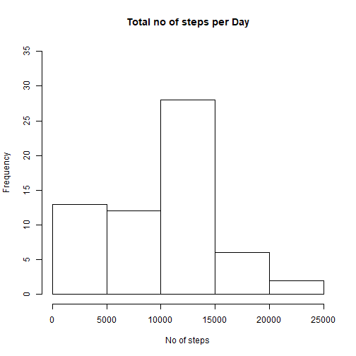
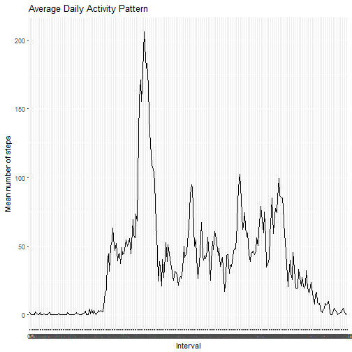
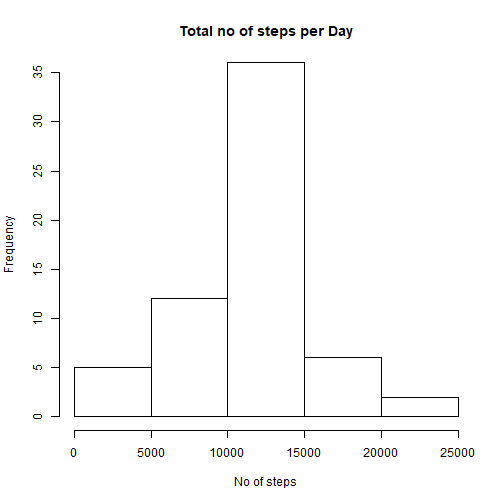
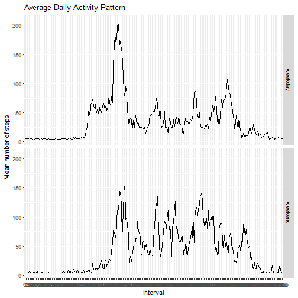

---
title: "Activity Monitoring"
author: "Aravind"
date: "March 23, 2018"
output:
  pdf_document: default
  html_document: default
---
Reproducible Research Project 1
=================================

## Introduction

It is now possible to collect a large amount of data about personal movement using activity monitoring devices such as a Fitbit, Nike Fuelband, or Jawbone Up. These type of devices are part of the "quantified self" movement - a group of enthusiasts who take measurements about themselves regularly to improve their health, to find patterns in their behavior, or because they are tech geeks. But these data remain under-utilized both because the raw data are hard to obtain and there is a lack of statistical methods and software for processing and interpreting the data.

This assignment makes use of data from a personal activity monitoring device. This device collects data at 5 minute intervals through out the day. The data consists of two months of data from an anonymous individual collected during the months of October and November, 2012 and include the number of steps taken in 5 minute intervals each day.

The data for this assignment can be downloaded from the course web site:

* Dataset: [Activity monitoring data [52K]](https://d396qusza40orc.cloudfront.net/repdata%2Fdata%2Factivity.zip)
The variables included in this dataset are:

* steps: Number of steps taking in a 5-minute interval (missing values are coded as NA)
* date: The date on which the measurement was taken in YYYY-MM-DD format
* interval: Identifier for the 5-minute interval in which measurement was taken

## 1. Loading and pre-processing the dataset


```r
## Download the file unzipping in the directory
download.file("https://d396qusza40orc.cloudfront.net/repdata%2Fdata%2Factivity.zip", "act_mon.zip")
zipF<-file.choose() # lets you choose a file and save its file path in R (at least for windows)
outDir<-"assignment1" # Define the folder where the zip file should be unzipped to 
unzip(zipF,exdir=outDir)

## Reading and pre-processing the activity monitoring dataset
activity <- read.csv(".//assignment1//activity.csv")
head(activity)
```

```
##   steps       date interval
## 1    NA 2012-10-01        0
## 2    NA 2012-10-01        5
## 3    NA 2012-10-01       10
## 4    NA 2012-10-01       15
## 5    NA 2012-10-01       20
## 6    NA 2012-10-01       25
```

```r
activity$date <- as.Date(as.character(activity$date), "%Y-%m-%d")
activity$interval <- as.factor(activity$interval)
str(activity)
```

```
## 'data.frame':	17568 obs. of  3 variables:
##  $ steps   : int  NA NA NA NA NA NA NA NA NA NA ...
##  $ date    : Date, format: "2012-10-01" "2012-10-01" ...
##  $ interval: Factor w/ 288 levels "0","5","10","15",..: 1 2 3 4 5 6 7 8 9 10 ...
```

## 2. Total number of steps taken per day


```r
## Calculating total number of steps taken per day
aggr_data <- aggregate(activity$steps, by = list(activity$date), sum, na.rm = TRUE)
names(aggr_data) <- c("Date", "sum")

##  Histogram plot of total no of steps taken per day
hist(aggr_data$sum, ylim = c(0,35),
     xlab = "No of steps", 
     ylab = "Frequency", 
     main = "Total no of steps per Day")
```



## 3. Mean and Median of total no of steps taken per day


```r
mean_data <- mean(aggr_data$sum, na.rm = T)
median_data <-  median(aggr_data$sum)
```
The mean and median values for the total number of steps per each day are 9354.2295082 and 10395

## 4. Time series plot of the average number of steps


```r
mean_interval <- aggregate(activity$steps, by = list(activity$interval), mean, na.rm = TRUE)
names(mean_interval) <- c("Interval", "average")
## Time series plot 
library(ggplot2)
```

```
## Need help? Try the ggplot2 mailing list:
## http://groups.google.com/group/ggplot2.
```

```r
ggplot(mean_interval, aes(Interval, average, group =1)) + 
  geom_line() +
  geom_path() + 
  ggtitle("Average Daily Activity Pattern") +
  labs(x="Interval", y = "Mean number of steps")
```



## 5. The  5-minute interval that, on average, contains the maximum number of steps


```r
I_max <- mean_interval[which.max(mean_interval$average),"Interval"]
```
The interval with maximum number of steps, on average across all days is 835

## 6. Strategy for imputing missing data


```r
summary(activity)
```

```
##      steps             date               interval    
##  Min.   :  0.00   Min.   :2012-10-01   0      :   61  
##  1st Qu.:  0.00   1st Qu.:2012-10-16   5      :   61  
##  Median :  0.00   Median :2012-10-31   10     :   61  
##  Mean   : 37.38   Mean   :2012-10-31   15     :   61  
##  3rd Qu.: 12.00   3rd Qu.:2012-11-15   20     :   61  
##  Max.   :806.00   Max.   :2012-11-30   25     :   61  
##  NA's   :2304                          (Other):17202
```

The dataset contains a total of 2304 NA values


```r
## Finding the positions of NA'sin activity dataset
na_pos <- which(is.na(activity$steps))

## Creating a vector to fill the missing values by using strategy of imputing the mean number of steps across each interval 
new_vector <- rep(mean(mean_interval$average, na.rm = TRUE), length(na_pos))

## Filling in the position of missing values with new values
activity[na_pos, "steps"] <- new_vector
head(activity)
```

```
##     steps       date interval
## 1 37.3826 2012-10-01        0
## 2 37.3826 2012-10-01        5
## 3 37.3826 2012-10-01       10
## 4 37.3826 2012-10-01       15
## 5 37.3826 2012-10-01       20
## 6 37.3826 2012-10-01       25
```

## 7. Histogram of the total number of steps taken each day after missing values are imputed


```r
## Calculating total number of steps taken per day for updated dataset
aggr_data1 <- aggregate(activity$steps, by = list(activity$date), sum)
names(aggr_data1) <- c("Date", "sum")

##  Histogram plot of total no of steps taken per day
hist(aggr_data1$sum, ylim = c(0,35),
     xlab = "No of steps", 
     ylab = "Frequency", 
     main = "Total no of steps per Day")
```




```r
## Computing mean and median for the new dataset
mean_data1 <- mean(aggr_data1$sum)
median_data1 <- median(aggr_data1$sum)
```
The new mean and median values for the total number of steps per each day are 1.0766189 &times; 10<sup>4</sup> and 1.0766189 &times; 10<sup>4</sup>

Therefore, after filling the missing values, the values of mean and median increased and is equal to 1.0766189 &times; 10<sup>4</sup>

## 8. Panel plot comparing the average number of steps taken per 5-minute interval across weekdays and weekends

```r
Day_Type <- function(date) {
  day <- weekdays(date)
    if ( day %in% c("Monday", "Tuesday", "Wednesday", "Thursday", "Friday"))
           return ("weekday")
  else if (day %in% c("Saturday", "Sunday"))
           return ("weekend")}

## Adding a new column to the dataset
activity$day_type <- sapply(activity$date, Day_Type)
head(activity)
```

```
##     steps       date interval day_type
## 1 37.3826 2012-10-01        0  weekday
## 2 37.3826 2012-10-01        5  weekday
## 3 37.3826 2012-10-01       10  weekday
## 4 37.3826 2012-10-01       15  weekday
## 5 37.3826 2012-10-01       20  weekday
## 6 37.3826 2012-10-01       25  weekday
```

```r
## Finding the mean of the total no of steps by day_type and interval
mean_interval1 <- aggregate(activity$steps, by = list(activity$day_type, activity$interval), mean)
names(mean_interval1) <- c("day_type", "interval", "average")
head(mean_interval1)
```

```
##   day_type interval  average
## 1  weekday        0 7.006569
## 2  weekend        0 4.672825
## 3  weekday        5 5.384347
## 4  weekend        5 4.672825
## 5  weekday       10 5.139902
## 6  weekend       10 4.672825
```

```r
## Time series plot 
library(ggplot2)
ggplot(mean_interval1, aes(interval, average, group =1)) + 
  facet_grid(day_type~.) +
  geom_line() +
  geom_path() + 
  ggtitle("Average Daily Activity Pattern") +
  labs(x="Interval", y = "Mean number of steps")
```



